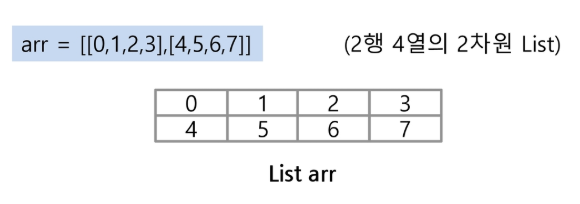
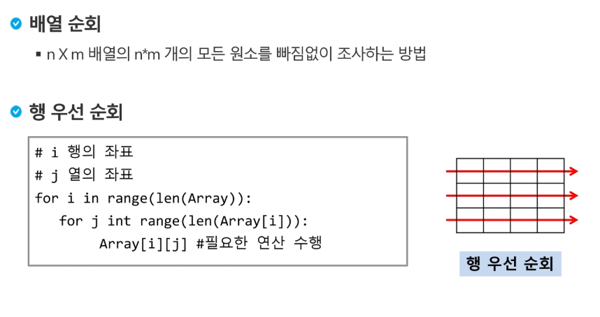
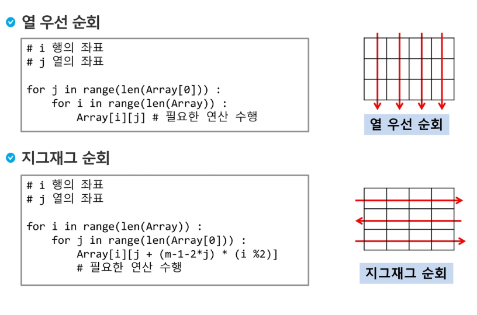
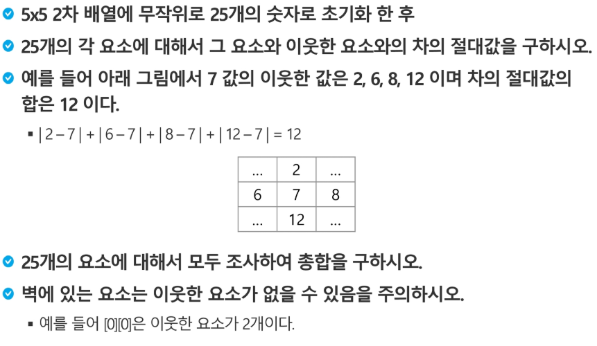
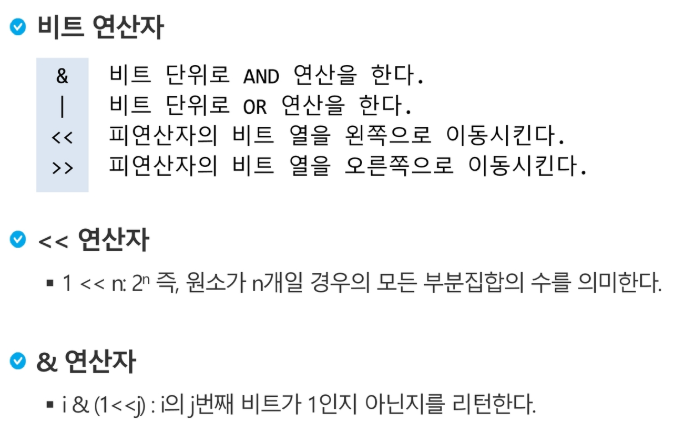

# 2차원 배열




##### 바깥의 for 문은 리스트 자체의 길이로 반복된다.





##### 행은 list 자체의 길이로 반복 , 열은 Array[0]의 길이로 반복.


### 지그재그 순회2

```python
m = 4
arr = [list(map(int, input().split())) for i in range(4)]
tmp = [[0]*m for i in range(m)]
print (arr)
for i in range(len(arr)):
    for j in range(len(arr[0])):
        if i%2 == 1:
            tmp[i][j] = arr[i][m-1-j]
        else:
            tmp[i][j] = arr[i][j]
print(tmp)

```


### 델타를 이용한 2차 배열 탐색

```python
m = 4
dx[] = [0,0,-1,1]
dy[] = [-1,1,0,0]
arr = [list(map(int,input().split())) for i in range(4)]
for x in range(len(ary)):
    for y in range(len(ary[x])):
        for I in range(4):
            testx = x + dx[I]
            testy = y + dy[I]
            test(arr[testx][testy])
            
			if 0 <= testx < m and 0 <= testy < m:
			print(arr[testx][testy])
```


### 전치 행렬

```python
arr = [[1,2,3],[4,5,6],[7,8,9]]
for i in range(3):
    for j in range(3):
        if i < j:
            arr[i][j], arr[j][i] = arr[j][i], arr[i][j]
```


#### 델타를 이용한 연습 문제



```python 
#코드1
di = [-1,0,1,0]
dj = [0,1,0,-1]

T = int(input())
for tc in range(1, T+1):
    N = int(input())
    arr = [list(map(int, input().split())) for i in range(N) ]  #N은 행의 개수
    res = 0
    tmp = [[0] * N for i in range(N)]

    for i in range(N):
        for j in range(N):
            k = arr[i][j]
            SUM = 0

            for x in range(4):
                dx=i+di[x]
                dy=j+dj[x]

                if 0 <= dx < N and 0 <= dy < N:
                    SUM += abs(k - arr[dx][dy])
            tmp[i][j] = SUM
    print(tmp)

    for i in range(4):
        for j in range(4):
            res += tmp[i][j]

    print(res)
```

```python
#코드2
di = [-1,0,1,0]
dj = [0,1,0,-1]

T = int(input())
for tc in range(1, T+1):
    N = int(input())
    arr = [list(map(int, input().split())) for i in range(N) ]  #N은 행의 개수
    res = 0
    tmp = [[0] * N for i in range(N)]

    for i in range(N):
        for j in range(N):
            for k in range(4):
                if i+di[k] >= 0 and i+di[k] < N and i+dj[k] >= 0 and i+dj[k] < N:
                    tmp[i][j] += abs(arr[i][j] - arr[i+ di[k]][j + dj[k]])


    for i in range(4):
        for j in range(4):
            res += tmp[i][j]


    print(res)
```




### 비트 연산으로 부분집합 생성하기

```python
arr = [1,2,3]
N=len(arr)

for i in range(1<<N):
    sub = []
    for j in range(N):
        if i & (1<<j):
            sub.append(arr[j])
    print(sub)
```

### 비트 연산으로 특정 합 부분집합만 출력

```python
arr = [1,2,3]
N=len(arr)

for i in range(1<<N):
    sub = []
    SUM = 0
    for j in range(N):
        if i & (1<<j):
            sub.append(arr[j])
            
    for x in range(len(sub)):
        SUM += sub[x]
    if SUM == 0:
        print(sub)
```

