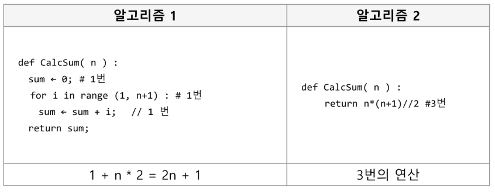
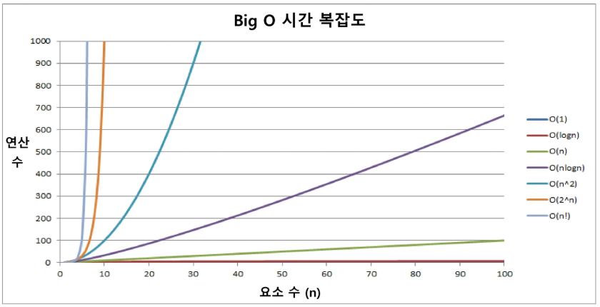

# 알고리즘

##### 알고리즘이란 문제를 해결하는 과정

- 알고리즘 표현 방법 : 수도코드 , 순서도

##### 좋은 알고리즘 이란?

1. 정확성 : 얼마나 정확하게 동작하는 지
2. 작업량 : 얼마나 적은 연산으로 결과를 얻어내는 지
3. 메모리 사용량 : 얼마나 적은 메모리를 사용하는지
4. 단순성 : 얼마나 단순한가
5. 최적성 : 더 이상 개선할 여지없이 최적화되었는 지


##### 시간 복잡도(Time Complexity) 

실제 걸리는 시간을 측정
실행되는 명령문의 개수를 계산



##### 빅-오(O) 표기법





##### 배열 입력 받을 때

ARR = [x for x in input()]
ARR = [int(x) for x in input()]
ARR = list(input().split())
ARR = list(map(int,input().split()))


### 완전 검색

문제의 해법으로 생각할 수 있는 모든 경우의 수를 나열하고 확인하는 방법. 
Brute-force 혹은 generate-and-test 기법이라고도 말함.

##### 완전 검색을 통한 Baby-Gin Game

```python
ARR = [int(x) for x in input()]
ch = 0

for i1 in range(3):
    for i2 in range(3):
        if i2 != i1:
            for i3 in range(3):
                if i3 != i1 and i3 != i2:
                    #print(ARR[i1], ARR[i2], ARR[i3])
                    if ARR[i1]+1 == ARR[i2] and ARR[i2]+1 == ARR[i3]:
                        print("run")
                        ch = 1
                        break
                    if ARR[i1]==ARR[i2] and ARR[i2] == ARR[i3]:
                        print("triple")
                        ch =1
                        break
        if ch == 1:
            break
    if ch == 1:
        break
```


### 탐욕 알고리즘

최적해를 구하는 데 사용되는 근시안적인 방법
여러 경우 중 하나를 결정해야 할 때, 그 순간에 최적이라고 새악되는 것을 선택해 나가는 방식으로 진행하여
최종적인 해답에 도달.

##### 탐욕 알고리즘의 동작 과정

1) 해 선택 : 현재 상태에서 최적  해를 구한 뒤, 이를 부분해 집합(Solution Set)에 추가한다.

2) 실행 가능성 검사 : 새로운 부분해 집합이 실행 가능한지 확인 -> 문제의 제약 조건을 위반하지 않는지 검사.

3) 해 검사 : 새로운 부분해 집합이 문제의 해가 되는지를 확인. 해가 완성 안되면 1) 해 선택부터 다시 시작


```python
ARR = [int(x) for x in input()]
count = [0] * 10

for i in ARR:
    count[i] += 1
print(count)

i = 0
run = 0
tri = run = 0
while i < len(count):
    if count[i] >= 3:#tri
        count[i] -= 3
        tri += 1
        continue
    if count[i] >= 1 and count[i+1] >= 1 and count[i+2] >=1:#run
        count[i] -= 1
        count[i+1] -= 1
        count[i+2] -= 1
        run += 1
        continue
    i = i+1

if run + tri == 2:
    print('Baby Gin')
else:
    print('Lose')
```


